#### Buffery
- ukládají data
- VBO, VAO, a EBO proměnné drží jen unsigned int IDčka korespondující k bufferu
	- 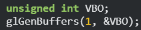
- Pak akorát přibindujeme toto IDčko k typu bufferu, který chceme
	- 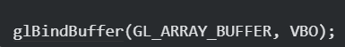
	- Nyní vždy když budeme něco měnit s GL_ARRAY_BUFFER to budeme vlastně měnit ve VBO proměnné, dokud ho neodbindujeme
- glBufferData -> překopírování našich dat do bufferu
	- 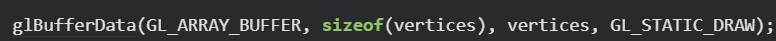[Obrazky PGR/Pasted-image-20240412213722.png"]
#### Shadery
##### Vertex Shader
- 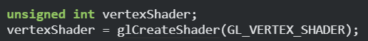
- 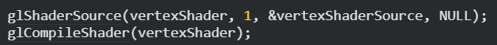
- pro kompilační chyby:
	- 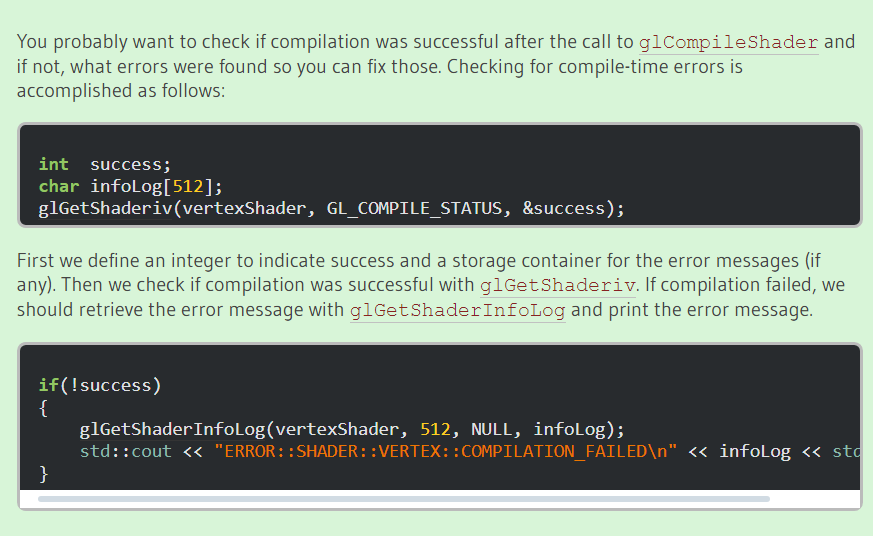
##### Fragment Shader
- 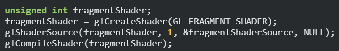
#### Shader Program
1. Vytvořit program, jeho ID uložit do proměnné
2. Připojit shadery
3. Slinkovat je (failne, pokud nesedí in a out proměnné)
4. Použít program
5. Vymazat shadery
- 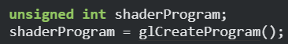
- 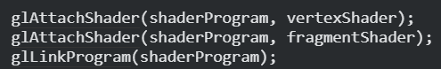
- 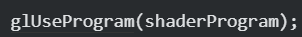
- 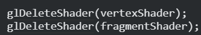
#### Vertex atributy
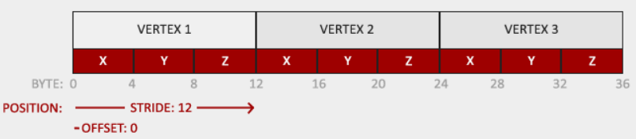

- id, počet, typ, normalizace, počet bytů mezi vertex daty, offset
#### EBO
- když chceme určit indexy jak by se měly kreslit trojúhelníky
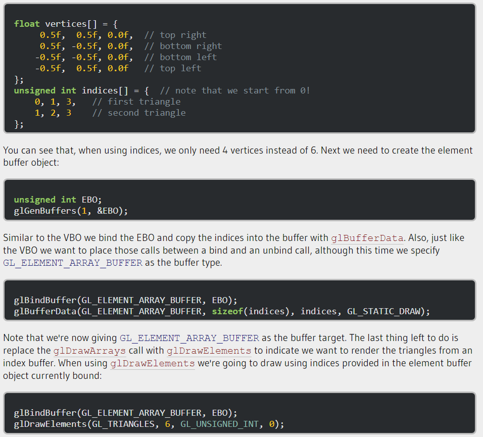
#### VAO
- když ho bindneme, a potom děláme všechny vbo a ebo příkazy, uloží se do vao a místo opakování všech vbo a ebo příkazů můžeme v budoucnu jen bindnout a unbindnout vao.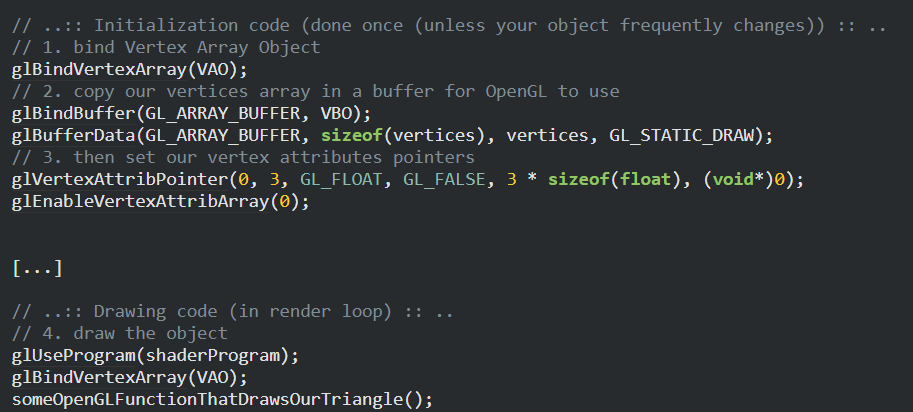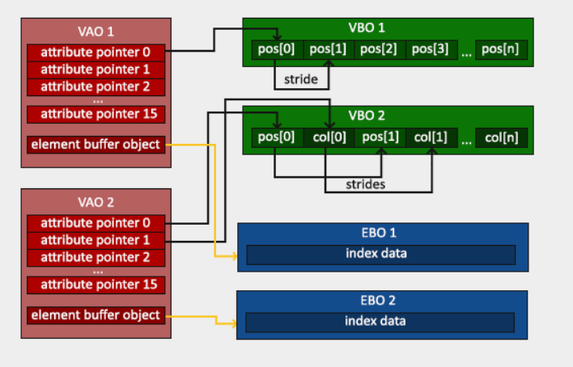