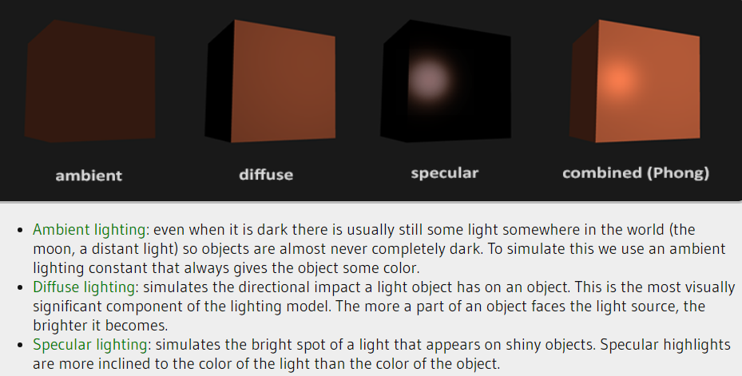
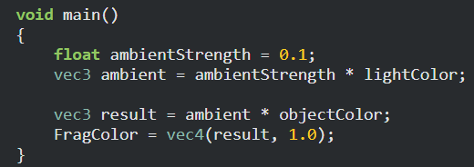
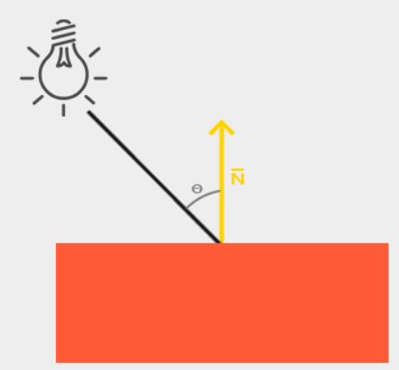
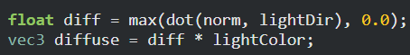
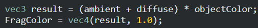
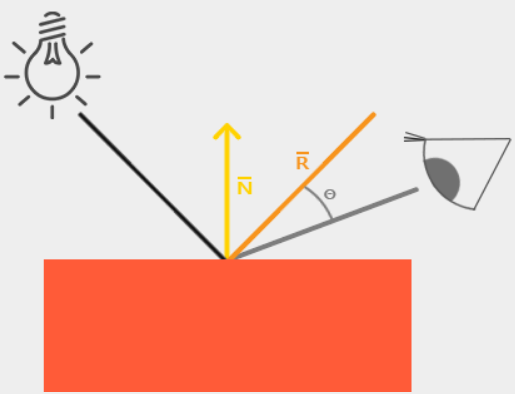

#### Phong Lighting Model
- Sestává ze 3 komponent:
	1. Ambient - i když je úplná tma, vidíme trochu objekt. Toto simuluje ambient light
	2. Diffuse - Simuluje brightness of object's faces podle toho jak blízko a z jakého úhlu k němu jde světlo
	3. Specular - Simuluje odrážení světla podle shininess materiálu

##### Ambient Light
- Vynásobíme ambient factor s barvou světla a objektu
- 
##### Diffuse light
- potřebujeme normálu objektu a vektor mezi světlem a fragmentem kam míří
- normála -> crossproduct, directed vector -> lightPos - fragPos
- čím menší je úhel, tím víc světlo na daný fragment působí
- když je úhel víc než 90, musíme ho nastavit zase na 90
 

- Normálu musíme také vynásobit modelovou maticí v případě, že někde provádíme non-uniform scales. Normála je ale vec3, a nechceme aby nám homogenní složka rozbila směr vektoru. Modelová matice pro normálu se dělá transpose(inverse(modelMatrix)).
- Transpose je dost náročný na výpočet, takže je lepší to dělat v CPU a ne ve shaderech, protože tam by se to počítalo pro každý vertex zvlášť.
##### Specular light

