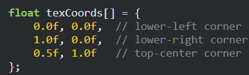
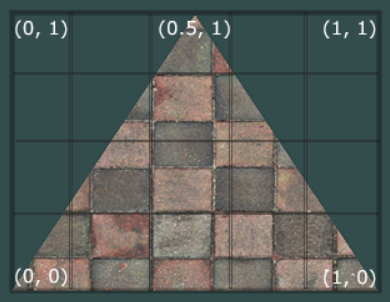
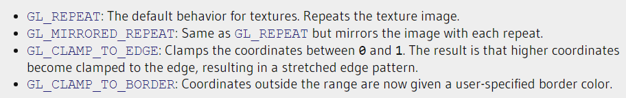
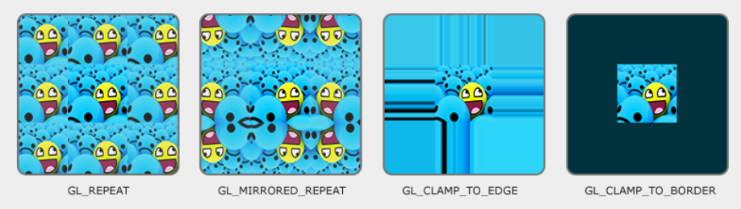
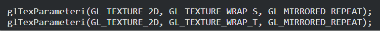
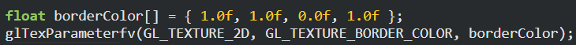
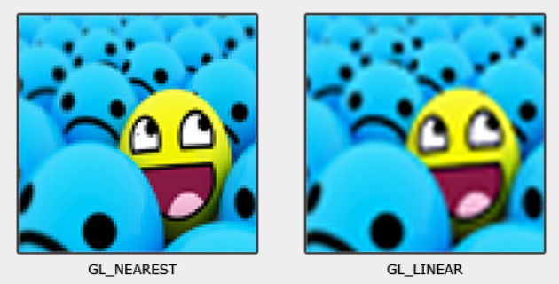
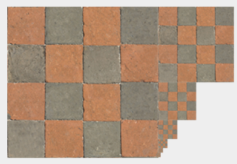
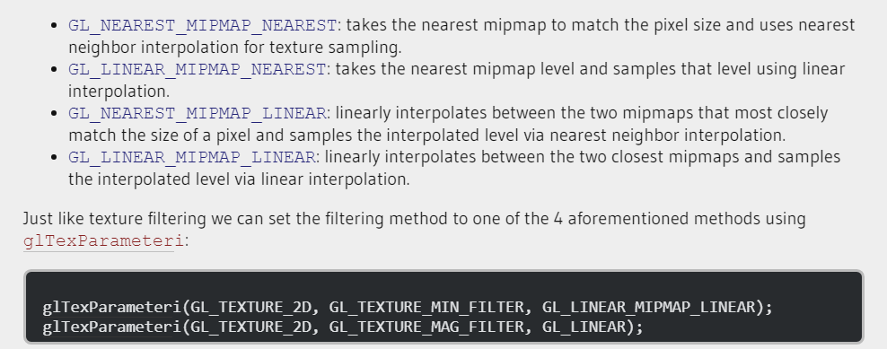

#### Textury

- Když specifikujeme souřadnice venku z (0,1) ->
	- 
	- 
	- můžeme nastavit pro každou osu zvlášť
		- 
		- 
##### Texture Filtering
- GL_NEAREST -> vybere barvu pixelu co je nejblíž k specifikované souřadnici
- GL_LINEAR -> udělá průměr z barev okolo podle toho jak jsou blízko
- 
#### Mipmaps
- když je objekt daleko, využijeme menší verzi dané textury místo složitému vypočítávání z velké textury.
- 
- mipmapu můžeme vytvořit snadno pomocí glGenerateMipmap
- když se mezi úrovněmi vybírají různé mipmapy, můžou být vidět artefakty. mezi mipmap vrstvami můžeme také vybrat Linear nebo Nearest filtering
- 
