## Transformace
- Nejdřív by se mělo zvětšit a pak až otočit, ale v OpenGL to musíme napsat naopak (pořadí matic čteme zprava)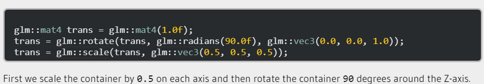
- Matici do shaderu pošleme pomocí uniformu, musíme poslat pointer
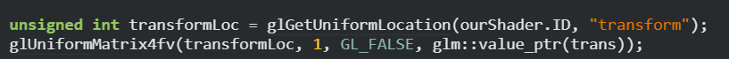
#### Cross product
- vstupem dva různoběžné vektory, a vyjde nám vektor kolmý k oběma vstupním vektorům
## Souřadnicové systémy
1. Local Space - Lokální souřadnice objektu (relativní ke svému vlastnímu originu)
-> Model Matrix
2. World Space - Relativní k originu světa
-> View Matrix
3. View Space - POV kamery / viewera
-> Projection Matrix
4. Clip Space - Pixely co jsou venku z určeného rozmezí jsou useknuty
-> Viewport transform
5. Screen Space - Finální obraz, co vidíme
##### Clip Space
###### Frustum
- projekční matice, která rozhoduje, které pixely budou viditelné
	- vlastně takový "box"
- 2 přístupy:
	1. Ortografická projekce
		- Nebere v potaz vzdálenosti
		- Specifikujeme šířku, výšku a délku (near and far plane)
		 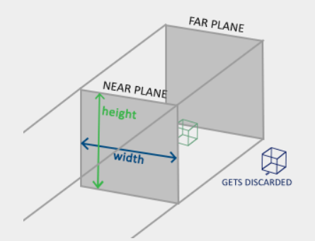
		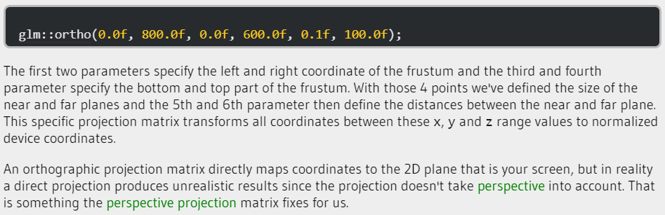
		 
	2. Perspektivní projekce
		- Realistický pohled (např. koleje se se zvětšující vzdáleností zmenšují)
		- w hodnota, kterou se dělí xyz, se postupně zvětšuje se vzdáleností
		- Specifikujeme FOV, Aspect ratio, near and far plane
		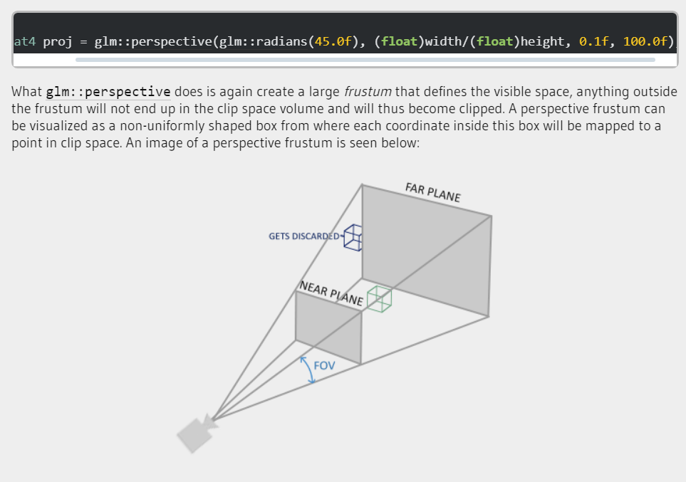
		
- Spíš se používá perspektivní projekce, ale ortografická se hodí například když něco modelujeme v Blenderu, abychom viděli objektivní velikosti
	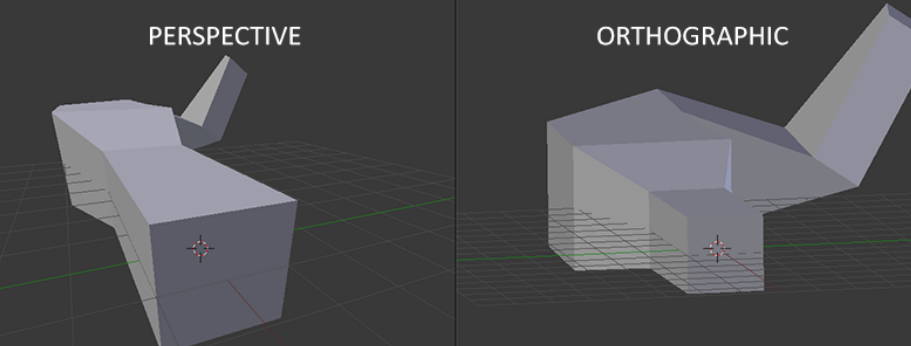

#### PVM Matrix - Souhrn
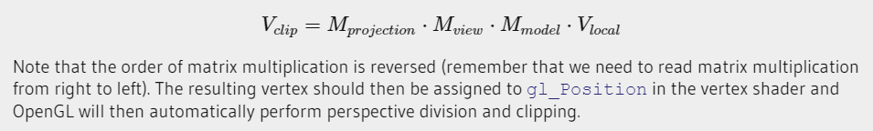
##### Model matrix
- transformace, které převedou model do global world space
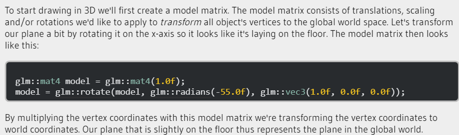
##### View matrix
- Když se chceme trochu oddálit, je to to samé, jako posunutí všech objektů dál od nás, což chceme udělat
	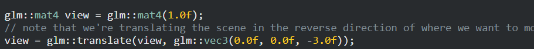
Poznámka: OpenGL je right handed system
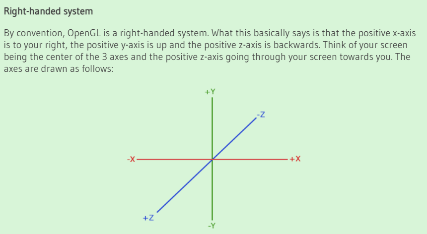
##### Projection matrix
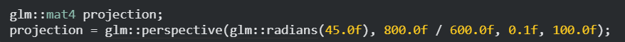

### Z-Buffer
- depth buffer
- ukládá informace o tom, jak "daleko" je který pixel a podle toho některé zobrazí a některé ne
- musíme spustit depth test (glEnable(GL_DEPTH_TEST))
- před každým vykreslením je potřeba z-buffer vyčistit (glClear(GL_DEPTH_BUFFER_BIT))

#### Kamera
- musíme vlastně vytvořit souřadnicový systém kamery - tedy pozici kamery, směr kam kouká, vektor směřující doprava, a vektor směřující nahoru z kamery
- ##### -> LookAt Matrix
	- GLM má svou speciální funkci LookAt, která nám tuto matici vytvoří. Musíme poskytnout akorát pozici kamery, target kam chceme koukat, a up vektor	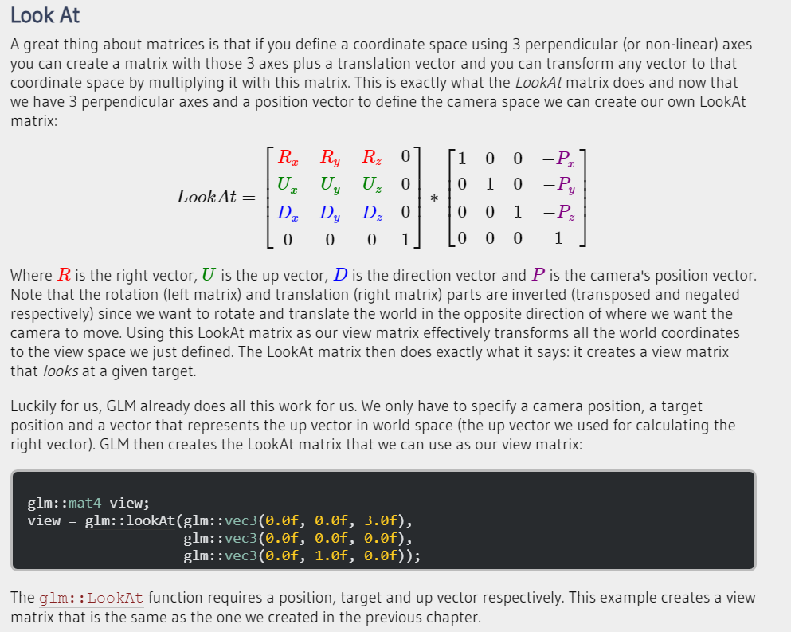